# ELSA models

## Features

### Original features

We selected from ELSA all the features that could be related to a cognitive disorder. Table 1 shows these features.

Table: Table 1

|skim_type |skim_variable | n_missing| complete_rate|factor.ordered | factor.n_unique|factor.top_counts  | numeric.mean| numeric.sd| numeric.p0| numeric.p25| numeric.p50| numeric.p75| numeric.p100|numeric.hist |Description                                                             |
|:---------|:-------------|---------:|-------------:|:--------------|---------------:|:------------------|------------:|----------:|----------:|-----------:|-----------:|-----------:|------------:|:------------|:-----------------------------------------------------------------------|
|factor    |dementia_w9   |         0|     1.0000000|FALSE          |               2|no: 8563, yes: 169 |           NA|         NA|         NA|          NA|          NA|          NA|           NA|NA           |                                                                        |
|numeric   |ragender      |         0|     1.0000000|NA             |              NA|NA                 |    1.5587494|  0.4965649|          1|           1|           2|           2|            2|▆▁▁▁▇        |1 RAGENDER ragender: r gender Categ                                     |
|numeric   |raracem       |         8|     0.9990838|NA             |              NA|NA                 |    1.1475241|  0.6487350|          1|           1|           1|           1|            4|▇▁▁▁▁        |1 RARACEM raracem: r race - masked Categ                                |
|numeric   |raedyrs_e     |       119|     0.9863720|NA             |              NA|NA                 |    3.6109370|  1.6307132|          0|           2|           3|           5|            6|▁▆▆▂▇        |1 RAEDYRS_E raedyrs_e: r years of education Categ                       |
|numeric   |rarelig_e     |       764|     0.9125057|NA             |              NA|NA                 |    2.5430472|  2.8504685|          1|           1|           1|           1|            8|▇▁▁▁▂        |1 RARELIG_E rarelig_e: r religion Categ                                 |
|numeric   |r7shlt        |      1826|     0.7908841|NA             |              NA|NA                 |    2.7125688|  1.0621831|          1|           2|           3|           3|            5|▃▇▇▅▁        |1 R1SHLT r1shlt:w1 r self-report of health Categ                        |
|numeric   |r7hlthlm      |      1831|     0.7903115|NA             |              NA|NA                 |    0.2608318|  0.4391201|          0|           0|           0|           1|            1|▇▁▁▁▃        |2 R2HLTHLM r2hlthlm:w2 r hlth problems limit work Categ                 |
|numeric   |r7adltot_e    |      1562|     0.8211177|NA             |              NA|NA                 |    0.2695955|  0.8241941|          0|           0|           0|           0|            6|▇▁▁▁▁        |1 R1ADLTOT_E r1adltot_e:w1 R Some Diff-ADLS:6-Item /0-6 Cont            |
|numeric   |r7iadltot2_e  |      1562|     0.8211177|NA             |              NA|NA                 |    0.3069735|  0.9305161|          0|           0|           0|           0|            9|▇▁▁▁▁        |4 R4IADLTOT2_E r4iadltot2_e:w4 R Some Diff-IADLs:9-item /0-9 Cont       |
|numeric   |r7jointre     |      3255|     0.6272332|NA             |              NA|NA                 |    0.1161220|  0.3204004|          0|           0|           0|           0|            1|▇▁▁▁▁        |1 R1JOINTRE r1jointre:w1 r ever had any joint replacement Categ         |
|numeric   |r7sight       |      1566|     0.8206596|NA             |              NA|NA                 |    2.4546469|  0.9386454|          1|           2|           2|           3|            6|▇▆▁▁▁        |1 R1SIGHT r1sight:w1 r self-rated eyesight Categ                        |
|numeric   |r7hearing     |      1563|     0.8210032|NA             |              NA|NA                 |    2.5986888|  1.0768741|          1|           2|           3|           3|            5|▅▇▇▃▁        |1 R1HEARING r1hearing:w1 r self-rated hearing Categ                     |
|numeric   |r7fallnum     |      3453|     0.6045579|NA             |              NA|NA                 |    0.6256867|  4.6816088|          0|           0|           0|           0|          201|▇▁▁▁▁        |1 R1FALLNUM r1fallnum:w1 r number of falls Cont                         |
|numeric   |r7painfr      |      1825|     0.7909986|NA             |              NA|NA                 |    0.3933690|  0.4885329|          0|           0|           0|           1|            1|▇▁▁▁▅        |1 R1PAINFR r1painfr:w1 r frequent problems with pain Categ              |
|numeric   |r7urinai      |      1825|     0.7909986|NA             |              NA|NA                 |    0.1497032|  0.3568061|          0|           0|           0|           0|            1|▇▁▁▁▂        |1 R1URINAI r1urinai:w1 r any urinary incontinence Categ                 |
|numeric   |r7vgactx_e    |      1563|     0.8210032|NA             |              NA|NA                 |    4.0361278|  1.2536578|          2|           3|           5|           5|            5|▃▂▁▁▇        |1 R1VGACTX_E r1vgactx_e:w1 R Freq vigorous phys activ Categ             |
|numeric   |r7mdactx_e    |      1562|     0.8211177|NA             |              NA|NA                 |    2.6750349|  1.0932803|          2|           2|           2|           3|            5|▇▂▁▁▂        |1 R1MDACTX_E r1mdactx_e:w1 R Freq moderate phys activ Categ             |
|numeric   |r7ltactx_e    |      1562|     0.8211177|NA             |              NA|NA                 |    2.3281729|  0.8114821|          2|           2|           2|           2|            5|▇▁▁▁▁        |1 R1LTACTX_E r1ltactx_e:w1 R Freq light phys activ Categ                |
|numeric   |r7drink       |      2460|     0.7182776|NA             |              NA|NA                 |    0.8801020|  0.3248681|          0|           1|           1|           1|            1|▁▁▁▁▇        |1 R1DRINK r1drink:w1 R ever drinks any alcohol Categ                    |
|numeric   |r7smokev      |      1660|     0.8098946|NA             |              NA|NA                 |    0.6040724|  0.4890836|          0|           0|           1|           1|            1|▅▁▁▁▇        |1 R1SMOKEV r1smokev:w1 R smoke ever Categ                               |
|numeric   |r7shltc       |      3662|     0.5806230|NA             |              NA|NA                 |    0.3824458|  0.6043568|          0|           0|           0|           1|            4|▇▃▁▁▁        |2 R2SHLTC r2shltc:w2 r Change in self-reported hlth Categ               |
|numeric   |r7adlc        |      2389|     0.7264086|NA             |              NA|NA                 |    0.1221819|  0.4503597|          0|           0|           0|           0|            5|▇▁▁▁▁        |2 R2ADLC r2adlc:w2 r Change-ADLs /0-5 Categ                             |
|numeric   |r7grossc      |      2413|     0.7236601|NA             |              NA|NA                 |    0.1476499|  0.4951878|          0|           0|           0|           0|            5|▇▁▁▁▁        |2 R2GROSSC r2grossc:w2 r Chg:Walk1/R,Clim1,Bed,Bath/5 Categ             |
|numeric   |r7finec       |      2303|     0.7362574|NA             |              NA|NA                 |    0.0802613|  0.3056676|          0|           0|           0|           0|            3|▇▁▁▁▁        |2 R2FINEC r2finec:w2 r Chg:Dime,Eat,Dress /0-3 Categ                    |
|numeric   |r7cogimp      |      1831|     0.7903115|NA             |              NA|NA                 |    0.0572381|  0.2323138|          0|           0|           0|           0|            1|▇▁▁▁▁        |1 R1COGIMP r1cogimp:w1 r whether factors impaired cognition tests Categ |
|numeric   |r7slfmem      |      1853|     0.7877920|NA             |              NA|NA                 |    3.1392644|  0.9131033|          1|           3|           3|           4|            5|▁▃▇▅▁        |1 R1SLFMEM r1slfmem:w1 r Self-reported memory Categ                     |
|numeric   |r7readrc      |      1855|     0.7875630|NA             |              NA|NA                 |    1.2002327|  0.4002035|          1|           1|           1|           1|            2|▇▁▁▁▂        |1 R1READRC r1readrc:w1 r word recall list read by Categ                 |
|numeric   |r7imrc        |      1835|     0.7898534|NA             |              NA|NA                 |    6.1520951|  1.7425451|          0|           5|           6|           7|           10|▁▂▇▇▁        |1 R1IMRC r1imrc:w1 r immediate word recall Cont                         |
|numeric   |r7dlrc        |      1825|     0.7909986|NA             |              NA|NA                 |    4.8510207|  2.0799158|          0|           4|           5|           6|           10|▂▆▇▃▁        |1 R1DLRC r1dlrc:w1 r delayed word recall Cont                           |
|numeric   |r7tr20        |      1835|     0.7898534|NA             |              NA|NA                 |   11.0097144|  3.5520318|          0|           9|          11|          13|           20|▁▃▇▅▁        |1 R1TR20 r1tr20:w1 r recall summary score Cont                          |
|numeric   |r7mo          |      1562|     0.8211177|NA             |              NA|NA                 |    0.0172943|  0.1303747|          0|           0|           0|           0|            1|▇▁▁▁▁        |7 R7MNRC r7mnrc:w7 r current monarch Categ                              |
|numeric   |r7orient      |      1909|     0.7813788|NA             |              NA|NA                 |    3.8194343|  0.4612741|          0|           4|           4|           4|            4|▁▁▁▁▇        |1 R1ORIENT r1orient:w1 r cognition orient (summary date naming) Cont    |
|numeric   |r7verbf       |      1825|     0.7909986|NA             |              NA|NA                 |   21.8737513|  7.0625224|          0|          17|          22|          26|           67|▁▇▃▁▁        |1 R1VERBF r1verbf:w1 r verbal fluency score Cont                        |
|numeric   |r7numer_e     |      8340|     0.0448923|NA             |              NA|NA                 |    4.4183673|  1.3064739|          0|           3|           5|           5|            6|▁▁▂▃▇        |1 R1NUMER_E r1numer_e:w1 r numeracy score Cont                          |
|numeric   |r7bwc20       |      1866|     0.7863033|NA             |              NA|NA                 |    1.9496068|  0.3116023|          0|           2|           2|           2|            2|▁▁▁▁▇        |7 R7BWC20 r7bwc20:w7 r Backwards Counting From 20 Categ                 |
|numeric   |r7ser7        |      2217|     0.7461063|NA             |              NA|NA                 |    4.4038373|  0.9672646|          0|           4|           5|           5|            5|▁▁▁▂▇        |7 R7SER7 r7ser7:w7 R serial 7s Cont                                     |
|numeric   |r7scis        |      1870|     0.7858452|NA             |              NA|NA                 |    0.9867386|  0.1144005|          0|           1|           1|           1|            1|▁▁▁▁▇        |7 R7SCIS r7scis:w7 r object naming scissors Categ                       |
|numeric   |r7mnrc        |      1884|     0.7842419|NA             |              NA|NA                 |    0.9853972|  0.1199653|          0|           1|           1|           1|            1|▁▁▁▁▇        |7 R7MNRC r7mnrc:w7 r current monarch Categ                              |
|numeric   |r8shlt        |      1872|     0.7856161|NA             |              NA|NA                 |    2.7635569|  1.0848591|          1|           2|           3|           3|            5|▃▇▇▅▂        |1 R1SHLT r1shlt:w1 r self-report of health Categ                        |
|numeric   |r8hlthlm      |      1876|     0.7851580|NA             |              NA|NA                 |    0.2780047|  0.4480484|          0|           0|           0|           1|            1|▇▁▁▁▃        |2 R2HLTHLM r2hlthlm:w2 r hlth problems limit work Categ                 |
|numeric   |r8adltot_e    |      1590|     0.8179111|NA             |              NA|NA                 |    0.3158779|  0.9142923|          0|           0|           0|           0|            6|▇▁▁▁▁        |1 R1ADLTOT_E r1adltot_e:w1 R Some Diff-ADLS:6-Item /0-6 Cont            |
|numeric   |r8iadltot2_e  |      1590|     0.8179111|NA             |              NA|NA                 |    0.3924671|  1.1004012|          0|           0|           0|           0|            9|▇▁▁▁▁        |4 R4IADLTOT2_E r4iadltot2_e:w4 R Some Diff-IADLs:9-item /0-9 Cont       |
|numeric   |r8jointre     |      2722|     0.6882730|NA             |              NA|NA                 |    0.1307820|  0.3371899|          0|           0|           0|           0|            1|▇▁▁▁▁        |1 R1JOINTRE r1jointre:w1 r ever had any joint replacement Categ         |
|numeric   |r8sight       |      1592|     0.8176821|NA             |              NA|NA                 |    2.4948179|  0.9653478|          1|           2|           2|           3|            6|▇▆▂▁▁        |1 R1SIGHT r1sight:w1 r self-rated eyesight Categ                        |
|numeric   |r8hearing     |      1591|     0.8177966|NA             |              NA|NA                 |    2.6573309|  1.0845547|          1|           2|           3|           3|            5|▃▆▇▃▁        |1 R1HEARING r1hearing:w1 r self-rated hearing Categ                     |
|numeric   |r8fallnum     |      2965|     0.6604443|NA             |              NA|NA                 |    0.7799549|  6.5584668|          0|           0|           0|           1|          400|▇▁▁▁▁        |1 R1FALLNUM r1fallnum:w1 r number of falls Cont                         |
|numeric   |r8fallslp_e   |      1873|     0.7855016|NA             |              NA|NA                 |    1.8865724|  1.1373811|          1|           1|           1|           3|            4|▇▂▁▂▂        |4 R4FALLSLP_E r4fallslp_e:w4 r trouble falling asleep Categ             |
|numeric   |r8painfr      |      1876|     0.7851580|NA             |              NA|NA                 |    0.4075263|  0.4914100|          0|           0|           0|           1|            1|▇▁▁▁▆        |1 R1PAINFR r1painfr:w1 r frequent problems with pain Categ              |
|numeric   |r8urinai      |      2496|     0.7141548|NA             |              NA|NA                 |    0.2317191|  0.4219643|          0|           0|           0|           0|            1|▇▁▁▁▂        |1 R1URINAI r1urinai:w1 r any urinary incontinence Categ                 |
|numeric   |r8vgactx_e    |      1590|     0.8179111|NA             |              NA|NA                 |    4.0985718|  1.2402599|          2|           3|           5|           5|            5|▃▁▁▁▇        |1 R1VGACTX_E r1vgactx_e:w1 R Freq vigorous phys activ Categ             |
|numeric   |r8mdactx_e    |      1590|     0.8179111|NA             |              NA|NA                 |    2.7507701|  1.1485621|          2|           2|           2|           3|            5|▇▂▁▁▂        |1 R1MDACTX_E r1mdactx_e:w1 R Freq moderate phys activ Categ             |
|numeric   |r8ltactx_e    |      1591|     0.8177966|NA             |              NA|NA                 |    2.3807590|  0.8776494|          2|           2|           2|           2|            5|▇▁▁▁▁        |1 R1LTACTX_E r1ltactx_e:w1 R Freq light phys activ Categ                |
|numeric   |r8drink       |      2495|     0.7142694|NA             |              NA|NA                 |    0.8670835|  0.3395117|          0|           1|           1|           1|            1|▁▁▁▁▇        |1 R1DRINK r1drink:w1 R ever drinks any alcohol Categ                    |
|numeric   |r8smokev      |      1669|     0.8088639|NA             |              NA|NA                 |    0.6114965|  0.4874445|          0|           0|           1|           1|            1|▅▁▁▁▇        |1 R1SMOKEV r1smokev:w1 R smoke ever Categ                               |
|numeric   |r8shltc       |      3374|     0.6136051|NA             |              NA|NA                 |    0.3865248|  0.6095664|          0|           0|           0|           1|            4|▇▃▁▁▁        |2 R2SHLTC r2shltc:w2 r Change in self-reported hlth Categ               |
|numeric   |r8adlc        |      2127|     0.7564132|NA             |              NA|NA                 |    0.1509463|  0.5344728|          0|           0|           0|           0|            5|▇▁▁▁▁        |2 R2ADLC r2adlc:w2 r Change-ADLs /0-5 Categ                             |
|numeric   |r8grossc      |      2165|     0.7520614|NA             |              NA|NA                 |    0.1804477|  0.5715844|          0|           0|           0|           0|            5|▇▁▁▁▁        |2 R2GROSSC r2grossc:w2 r Chg:Walk1/R,Clim1,Bed,Bath/5 Categ             |
|numeric   |r8finec       |      2022|     0.7684379|NA             |              NA|NA                 |    0.0976155|  0.3442481|          0|           0|           0|           0|            3|▇▁▁▁▁        |2 R2FINEC r2finec:w2 r Chg:Dime,Eat,Dress /0-3 Categ                    |
|numeric   |r8cogimp      |      1886|     0.7840128|NA             |              NA|NA                 |    0.0501022|  0.2181719|          0|           0|           0|           0|            1|▇▁▁▁▁        |1 R1COGIMP r1cogimp:w1 r whether factors impaired cognition tests Categ |
|numeric   |r8slfmem      |      1898|     0.7826386|NA             |              NA|NA                 |    3.1695932|  0.9056501|          1|           3|           3|           4|            5|▁▃▇▅▁        |1 R1SLFMEM r1slfmem:w1 r Self-reported memory Categ                     |
|numeric   |r8readrc      |      1909|     0.7813788|NA             |              NA|NA                 |    1.2295178|  0.4205536|          1|           1|           1|           1|            2|▇▁▁▁▂        |1 R1READRC r1readrc:w1 r word recall list read by Categ                 |
|numeric   |r8imrc        |      1909|     0.7813788|NA             |              NA|NA                 |    6.1184230|  1.7496624|          0|           5|           6|           7|           10|▁▂▇▇▂        |1 R1IMRC r1imrc:w1 r immediate word recall Cont                         |
|numeric   |r8dlrc        |      1876|     0.7851580|NA             |              NA|NA                 |    4.7745041|  2.1997077|          0|           4|           5|           6|           10|▃▆▇▃▁        |1 R1DLRC r1dlrc:w1 r delayed word recall Cont                           |
|numeric   |r8tr20        |      1909|     0.7813788|NA             |              NA|NA                 |   10.9157262|  3.6601153|          0|           9|          11|          13|           20|▁▃▇▅▁        |1 R1TR20 r1tr20:w1 r recall summary score Cont                          |
|numeric   |r8mo          |      1590|     0.8179111|NA             |              NA|NA                 |    0.0236628|  0.1520071|          0|           0|           0|           0|            1|▇▁▁▁▁        |7 R7MNRC r7mnrc:w7 r current monarch Categ                              |
|numeric   |r8orient      |      1959|     0.7756528|NA             |              NA|NA                 |    3.7959545|  0.5152731|          0|           4|           4|           4|            4|▁▁▁▂▇        |1 R1ORIENT r1orient:w1 r cognition orient (summary date naming) Cont    |
|numeric   |r8verbf       |      1876|     0.7851580|NA             |              NA|NA                 |   21.9585764|  7.2890337|          0|          17|          22|          26|           99|▅▇▁▁▁        |1 R1VERBF r1verbf:w1 r verbal fluency score Cont                        |
|numeric   |r8numer_e     |      8562|     0.0194686|NA             |              NA|NA                 |    3.4294118|  2.1968953|          0|           2|           4|           5|            6|▅▁▂▃▇        |1 R1NUMER_E r1numer_e:w1 r numeracy score Cont                          |
|numeric   |r8bwc20       |      1924|     0.7796610|NA             |              NA|NA                 |    1.9452115|  0.3253557|          0|           2|           2|           2|            2|▁▁▁▁▇        |7 R7BWC20 r7bwc20:w7 r Backwards Counting From 20 Categ                 |
|numeric   |r8ser7        |      2321|     0.7341961|NA             |              NA|NA                 |    4.3952582|  0.9914152|          0|           4|           5|           5|            5|▁▁▁▂▇        |7 R7SER7 r7ser7:w7 R serial 7s Cont                                     |
|numeric   |r8scis        |      1921|     0.7800046|NA             |              NA|NA                 |    0.9844369|  0.1237865|          0|           1|           1|           1|            1|▁▁▁▁▇        |7 R7SCIS r7scis:w7 r object naming scissors Categ                       |
|numeric   |r8mnrc        |      1934|     0.7785158|NA             |              NA|NA                 |    0.9864666|  0.1155517|          0|           1|           1|           1|            1|▁▁▁▁▇        |7 R7MNRC r7mnrc:w7 r current monarch Categ                              |
|numeric   |r9agey        |         0|     1.0000000|NA             |              NA|NA                 |   67.8151626| 10.6782350|         30|          60|          68|          75|           90|▁▃▆▇▃        |1 R1AGEY r1agey:w1 r age (years) at ivw Cont                            |
|numeric   |r9shlt        |       546|     0.9374714|NA             |              NA|NA                 |    2.7878085|  1.1095423|          1|           2|           3|           4|            5|▃▇▇▅▂        |1 R1SHLT r1shlt:w1 r self-report of health Categ                        |
|numeric   |r9hlthlm      |       551|     0.9368988|NA             |              NA|NA                 |    0.2838284|  0.4508821|          0|           0|           0|           1|            1|▇▁▁▁▃        |2 R2HLTHLM r2hlthlm:w2 r hlth problems limit work Categ                 |
|numeric   |r9adltot_e    |         3|     0.9996564|NA             |              NA|NA                 |    0.3861840|  1.0577490|          0|           0|           0|           0|            6|▇▁▁▁▁        |1 R1ADLTOT_E r1adltot_e:w1 R Some Diff-ADLS:6-Item /0-6 Cont            |
|numeric   |r9iadltot2_e  |         3|     0.9996564|NA             |              NA|NA                 |    0.5087639|  1.3781713|          0|           0|           0|           0|            9|▇▁▁▁▁        |4 R4IADLTOT2_E r4iadltot2_e:w4 R Some Diff-IADLs:9-item /0-9 Cont       |
|numeric   |r9jointre     |      2065|     0.7635135|NA             |              NA|NA                 |    0.1436928|  0.3508043|          0|           0|           0|           0|            1|▇▁▁▁▂        |1 R1JOINTRE r1jointre:w1 r ever had any joint replacement Categ         |
|numeric   |r9sight       |         5|     0.9994274|NA             |              NA|NA                 |    2.5287040|  0.9911689|          1|           2|           3|           3|            6|▇▆▂▁▁        |1 R1SIGHT r1sight:w1 r self-rated eyesight Categ                        |
|numeric   |r9hearing     |         3|     0.9996564|NA             |              NA|NA                 |    2.6463512|  1.0911320|          1|           2|           3|           3|            5|▃▆▇▃▁        |1 R1HEARING r1hearing:w1 r self-rated hearing Categ                     |
|numeric   |r9fallnum     |      2465|     0.7177050|NA             |              NA|NA                 |    0.7647997|  6.1736924|          0|           0|           0|           1|          365|▇▁▁▁▁        |1 R1FALLNUM r1fallnum:w1 r number of falls Cont                         |
|numeric   |r9painfr      |       546|     0.9374714|NA             |              NA|NA                 |    0.4094796|  0.4917678|          0|           0|           0|           1|            1|▇▁▁▁▆        |1 R1PAINFR r1painfr:w1 r frequent problems with pain Categ              |
|numeric   |r9urinai      |      1303|     0.8507787|NA             |              NA|NA                 |    0.2129493|  0.4094196|          0|           0|           0|           0|            1|▇▁▁▁▂        |1 R1URINAI r1urinai:w1 r any urinary incontinence Categ                 |
|numeric   |r9vgactx_e    |         1|     0.9998855|NA             |              NA|NA                 |    4.0766235|  1.2651709|          2|           3|           5|           5|            5|▃▁▁▁▇        |1 R1VGACTX_E r1vgactx_e:w1 R Freq vigorous phys activ Categ             |
|numeric   |r9mdactx_e    |         0|     1.0000000|NA             |              NA|NA                 |    2.8273019|  1.1974647|          2|           2|           2|           4|            5|▇▂▁▁▂        |1 R1MDACTX_E r1mdactx_e:w1 R Freq moderate phys activ Categ             |
|numeric   |r9ltactx_e    |         1|     0.9998855|NA             |              NA|NA                 |    2.4209140|  0.9261469|          2|           2|           2|           2|            5|▇▁▁▁▁        |1 R1LTACTX_E r1ltactx_e:w1 R Freq light phys activ Categ                |
|numeric   |r9drink       |      1303|     0.8507787|NA             |              NA|NA                 |    0.8596043|  0.3474205|          0|           1|           1|           1|            1|▁▁▁▁▇        |1 R1DRINK r1drink:w1 R ever drinks any alcohol Categ                    |
|numeric   |r9smokev      |       204|     0.9766377|NA             |              NA|NA                 |    0.5988508|  0.4901599|          0|           0|           1|           1|            1|▆▁▁▁▇        |1 R1SMOKEV r1smokev:w1 R smoke ever Categ                               |
|numeric   |r9shltc       |      3253|     0.6274622|NA             |              NA|NA                 |    0.4203322|  0.6335766|          0|           0|           0|           1|            4|▇▃▁▁▁        |2 R2SHLTC r2shltc:w2 r Change in self-reported hlth Categ               |
|numeric   |r9adlc        |      1817|     0.7919148|NA             |              NA|NA                 |    0.2046276|  0.6442209|          0|           0|           0|           0|            5|▇▁▁▁▁        |2 R2ADLC r2adlc:w2 r Change-ADLs /0-5 Categ                             |
|numeric   |r9grossc      |      1923|     0.7797755|NA             |              NA|NA                 |    0.2370392|  0.6812301|          0|           0|           0|           0|            5|▇▁▁▁▁        |2 R2GROSSC r2grossc:w2 r Chg:Walk1/R,Clim1,Bed,Bath/5 Categ             |
|numeric   |r9finec       |      1741|     0.8006184|NA             |              NA|NA                 |    0.1237305|  0.4009954|          0|           0|           0|           0|            3|▇▁▁▁▁        |2 R2FINEC r2finec:w2 r Chg:Dime,Eat,Dress /0-3 Categ                    |
|numeric   |r9cogimp      |       560|     0.9358681|NA             |              NA|NA                 |    0.0602056|  0.2378819|          0|           0|           0|           0|            1|▇▁▁▁▁        |1 R1COGIMP r1cogimp:w1 r whether factors impaired cognition tests Categ |
|numeric   |r9slfmem      |       575|     0.9341503|NA             |              NA|NA                 |    3.1278656|  0.9306268|          1|           3|           3|           4|            5|▁▃▇▅▁        |1 R1SLFMEM r1slfmem:w1 r Self-reported memory Categ                     |
|numeric   |r9readrc      |       598|     0.9315163|NA             |              NA|NA                 |    1.2944431|  0.4558200|          1|           1|           1|           2|            2|▇▁▁▁▃        |1 R1READRC r1readrc:w1 r word recall list read by Categ                 |
|numeric   |r9imrc        |       599|     0.9314017|NA             |              NA|NA                 |    6.0279110|  1.7695804|          0|           5|           6|           7|           10|▁▂▇▇▁        |1 R1IMRC r1imrc:w1 r immediate word recall Cont                         |
|numeric   |r9dlrc        |       552|     0.9367842|NA             |              NA|NA                 |    4.6718826|  2.1457850|          0|           3|           5|           6|           10|▃▆▇▃▁        |1 R1DLRC r1dlrc:w1 r delayed word recall Cont                           |
|numeric   |r9tr20        |       600|     0.9312872|NA             |              NA|NA                 |   10.7267585|  3.6433832|          0|           9|          11|          13|           20|▁▃▇▅▁        |1 R1TR20 r1tr20:w1 r recall summary score Cont                          |
|numeric   |r9mo          |         3|     0.9996564|NA             |              NA|NA                 |    0.0419292|  0.2004389|          0|           0|           0|           0|            1|▇▁▁▁▁        |7 R7MNRC r7mnrc:w7 r current monarch Categ                              |
|numeric   |r9orient      |       658|     0.9246450|NA             |              NA|NA                 |    3.7870944|  0.5401065|          0|           4|           4|           4|            4|▁▁▁▂▇        |1 R1ORIENT r1orient:w1 r cognition orient (summary date naming) Cont    |
|numeric   |r9verbf       |       551|     0.9368988|NA             |              NA|NA                 |   22.1592715|  7.4846989|          0|          17|          22|          27|           56|▁▇▇▁▁        |1 R1VERBF r1verbf:w1 r verbal fluency score Cont                        |
|numeric   |r9numer_e     |      7551|     0.1352497|NA             |              NA|NA                 |    4.3378493|  1.3679745|          0|           3|           5|           5|            6|▁▁▃▃▇        |1 R1NUMER_E r1numer_e:w1 r numeracy score Cont                          |
|numeric   |r9bwc20       |       618|     0.9292258|NA             |              NA|NA                 |    1.9368992|  0.3482081|          0|           2|           2|           2|            2|▁▁▁▁▇        |7 R7BWC20 r7bwc20:w7 r Backwards Counting From 20 Categ                 |
|numeric   |r9ser7        |      1134|     0.8701328|NA             |              NA|NA                 |    4.4020795|  0.9911181|          0|           4|           5|           5|            5|▁▁▁▂▇        |7 R7SER7 r7ser7:w7 R serial 7s Cont                                     |
|numeric   |r9scis        |       613|     0.9297984|NA             |              NA|NA                 |    0.9896539|  0.1011945|          0|           1|           1|           1|            1|▁▁▁▁▇        |7 R7SCIS r7scis:w7 r object naming scissors Categ                       |
|numeric   |r9mnrc        |       642|     0.9264773|NA             |              NA|NA                 |    0.9833127|  0.1281048|          0|           1|           1|           1|            1|▁▁▁▁▇        |7 R7MNRC r7mnrc:w7 r current monarch Categ                              |

We used features from waves 7, 8 and 9. These waves represents the most recent waves available in the ELSA. The figure below shows the data blocks used in this experiment.

### Constructed Temporal Features

The longitudinal data are built based on sectional features. We added the **C**onstructed **T**emporal **F**eatures (CTFs). Our CTFs implemented are described below:

The figure below shows the data and waves for each CTF function.

Table 2 shows the CTFs.

Table: Table 2

|skim_type |skim_variable                     | n_missing| complete_rate|factor.ordered | factor.n_unique|factor.top_counts  | logical.mean|logical.count | numeric.mean| numeric.sd|   numeric.p0| numeric.p25| numeric.p50| numeric.p75| numeric.p100|numeric.hist |
|:---------|:---------------------------------|---------:|-------------:|:--------------|---------------:|:------------------|------------:|:-------------|------------:|----------:|------------:|-----------:|-----------:|-----------:|------------:|:------------|
|factor    |dementia_w9                       |         0|     1.0000000|FALSE          |               2|no: 8563, yes: 169 |           NA|NA            |           NA|         NA|           NA|          NA|          NA|          NA|           NA|NA           |
|logical   |f_r8fallslp_monotonicity          |      8732|     0.0000000|NA             |              NA|NA                 |          NaN|:             |           NA|         NA|           NA|          NA|          NA|          NA|           NA|NA           |
|logical   |f_r9bwc20_monotonicity            |      8732|     0.0000000|NA             |              NA|NA                 |          NaN|:             |           NA|         NA|           NA|          NA|          NA|          NA|           NA|NA           |
|logical   |f_r9ser7_monotonicity             |      8732|     0.0000000|NA             |              NA|NA                 |          NaN|:             |           NA|         NA|           NA|          NA|          NA|          NA|           NA|NA           |
|logical   |f_r9scis_monotonicity             |      8732|     0.0000000|NA             |              NA|NA                 |          NaN|:             |           NA|         NA|           NA|          NA|          NA|          NA|           NA|NA           |
|logical   |f_r9mnrc_monotonicity             |      8732|     0.0000000|NA             |              NA|NA                 |          NaN|:             |           NA|         NA|           NA|          NA|          NA|          NA|           NA|NA           |
|numeric   |f_r9shlt_monotonicity             |      2085|     0.7612231|NA             |              NA|NA                 |           NA|NA            |    0.0666466|  0.7899721|   -3.0000000|   0.0000000|   0.0000000|   1.0000000|     3.000000|▁▃▇▃▁        |
|numeric   |f_r9shlt_slope                    |      1543|     0.8232936|NA             |              NA|NA                 |           NA|NA            |    0.0673900|  0.1944903|   -2.0000000|  -0.0166667|   0.0666667|   0.1621622|     2.000000|▁▁▇▁▁        |
|numeric   |f_r9shlt_intercept                |      1543|     0.8232936|NA             |              NA|NA                 |           NA|NA            |    2.2362591|  1.5404927|  -13.3333333|   1.3630573|   2.1428571|   3.0000000|    19.000000|▁▁▇▁▁        |
|numeric   |f_r9shlt_r8shlt_diff              |      2017|     0.7690105|NA             |              NA|NA                 |           NA|NA            |    0.0713328|  0.8723085|   -3.0000000|   0.0000000|   0.0000000|   1.0000000|     4.000000|▁▂▇▁▁        |
|numeric   |f_r9shlt_r8shlt_ratio             |      2017|     0.7690105|NA             |              NA|NA                 |           NA|NA            |    1.1052842|  0.4699426|    0.2500000|   1.0000000|   1.0000000|   1.2500000|     5.000000|▇▃▁▁▁        |
|numeric   |f_r9hlthlm_monotonicity           |      2104|     0.7590472|NA             |              NA|NA                 |           NA|NA            |    0.0279119|  0.4311397|   -1.0000000|   0.0000000|   0.0000000|   0.0000000|     1.000000|▁▁▇▁▁        |
|numeric   |f_r9hlthlm_slope                  |      1572|     0.8199725|NA             |              NA|NA                 |           NA|NA            |    0.0154763|  0.0892456|   -0.5000000|   0.0000000|   0.0000000|   0.0238095|     0.500000|▁▁▇▁▁        |
|numeric   |f_r9hlthlm_intercept              |      1572|     0.8199725|NA             |              NA|NA                 |           NA|NA            |    0.1780564|  0.5883224|   -3.1666667|   0.0000000|   0.0000000|   0.3571429|     4.166667|▁▁▇▁▁        |
|numeric   |f_r9hlthlm_r8hlthlm_diff          |      2027|     0.7678653|NA             |              NA|NA                 |           NA|NA            |    0.0281879|  0.4293235|   -1.0000000|   0.0000000|   0.0000000|   0.0000000|     1.000000|▁▁▇▁▁        |
|numeric   |f_r9hlthlm_r8hlthlm_ratio         |      6896|     0.2102611|NA             |              NA|NA                 |           NA|NA            |    0.7135076|  0.4522454|    0.0000000|   0.0000000|   1.0000000|   1.0000000|     1.000000|▃▁▁▁▇        |
|numeric   |f_r9adltot_monotonicity           |      1836|     0.7897389|NA             |              NA|NA                 |           NA|NA            |    0.0494490|  0.5274397|   -3.0000000|   0.0000000|   0.0000000|   0.0000000|     5.000000|▁▇▁▁▁        |
|numeric   |f_r9adltot_slope                  |      1339|     0.8466560|NA             |              NA|NA                 |           NA|NA            |    0.0296374|  0.1658959|   -2.0000000|   0.0000000|   0.0000000|   0.0000000|     2.500000|▁▁▇▁▁        |
|numeric   |f_r9adltot_intercept              |      1339|     0.8466560|NA             |              NA|NA                 |           NA|NA            |    0.0976342|  1.1133182|  -18.3333333|   0.0000000|   0.0000000|   0.0000000|    17.666667|▁▁▇▁▁        |
|numeric   |f_r9adltot_e_r8adltot_e_diff      |      1592|     0.8176821|NA             |              NA|NA                 |           NA|NA            |    0.0942577|  0.8674245|   -6.0000000|   0.0000000|   0.0000000|   0.0000000|     6.000000|▁▁▇▁▁        |
|numeric   |f_r9adltot_e_r8adltot_e_ratio     |      7606|     0.1289510|NA             |              NA|NA                 |           NA|NA            |    0.8945678|  0.9994210|    0.0000000|   0.0000000|   1.0000000|   1.0000000|     6.000000|▇▂▁▁▁        |
|numeric   |f_r9iadltot2_monotonicity         |      1836|     0.7897389|NA             |              NA|NA                 |           NA|NA            |    0.0883121|  0.5925838|   -3.0000000|   0.0000000|   0.0000000|   0.0000000|     4.000000|▁▁▇▁▁        |
|numeric   |f_r9iadltot2_slope                |      1349|     0.8455108|NA             |              NA|NA                 |           NA|NA            |    0.0605512|  0.2773959|   -3.5000000|   0.0000000|   0.0000000|   0.0000000|     3.200000|▁▁▇▁▁        |
|numeric   |f_r9iadltot2_intercept            |      1349|     0.8455108|NA             |              NA|NA                 |           NA|NA            |    0.1295969|  1.0888297|  -11.6666667|   0.0000000|   0.0000000|   0.0000000|    23.500000|▁▇▁▁▁        |
|numeric   |f_r9iadltot2_e_r8iadltot2_e_diff  |      1592|     0.8176821|NA             |              NA|NA                 |           NA|NA            |    0.1574230|  1.0529514|   -9.0000000|   0.0000000|   0.0000000|   0.0000000|     9.000000|▁▁▇▁▁        |
|numeric   |f_r9iadltot2_e_r8iadltot2_e_ratio |      7423|     0.1499084|NA             |              NA|NA                 |           NA|NA            |    0.9647198|  1.0905243|    0.0000000|   0.0000000|   1.0000000|   1.2857143|     9.000000|▇▁▁▁▁        |
|numeric   |f_r9jointre_monotonicity          |      3452|     0.6046725|NA             |              NA|NA                 |           NA|NA            |    0.0214015|  0.1447324|    0.0000000|   0.0000000|   0.0000000|   0.0000000|     1.000000|▇▁▁▁▁        |
|numeric   |f_r9jointre_slope                 |      3130|     0.6415483|NA             |              NA|NA                 |           NA|NA            |    0.0207014|  0.0646749|    0.0000000|   0.0000000|   0.0000000|   0.0000000|     0.500000|▇▁▁▁▁        |
|numeric   |f_r9jointre_intercept             |      3130|     0.6415483|NA             |              NA|NA                 |           NA|NA            |   -0.0273787|  0.3972660|   -3.6666667|   0.0000000|   0.0000000|   0.0000000|     1.000000|▁▁▁▇▁        |
|numeric   |f_r9jointre_r8jointre_diff        |      2722|     0.6882730|NA             |              NA|NA                 |           NA|NA            |    0.0209651|  0.1432792|    0.0000000|   0.0000000|   0.0000000|   0.0000000|     1.000000|▇▁▁▁▁        |
|numeric   |f_r9jointre_r8jointre_ratio       |      7946|     0.0900137|NA             |              NA|NA                 |           NA|NA            |    1.0000000|  0.0000000|    1.0000000|   1.0000000|   1.0000000|   1.0000000|     1.000000|▁▁▇▁▁        |
|numeric   |f_r9sight_monotonicity            |      1840|     0.7892808|NA             |              NA|NA                 |           NA|NA            |    0.0606500|  0.8222215|   -3.0000000|   0.0000000|   0.0000000|   1.0000000|     4.000000|▁▂▇▁▁        |
|numeric   |f_r9sight_slope                   |      1341|     0.8464269|NA             |              NA|NA                 |           NA|NA            |    0.0268204|  0.2076757|   -1.5000000|  -0.0666667|   0.0166667|   0.1166667|     1.500000|▁▁▇▁▁        |
|numeric   |f_r9sight_intercept               |      1341|     0.8464269|NA             |              NA|NA                 |           NA|NA            |    2.2900088|  1.5851160|   -9.0000000|   1.5523810|   2.3000000|   3.0000000|    15.333333|▁▁▇▁▁        |
|numeric   |f_r9sight_r8sight_diff            |      1596|     0.8172240|NA             |              NA|NA                 |           NA|NA            |    0.0605381|  0.9504801|   -4.0000000|   0.0000000|   0.0000000|   1.0000000|     5.000000|▁▂▇▁▁        |
|numeric   |f_r9sight_r8sight_ratio           |      1596|     0.8172240|NA             |              NA|NA                 |           NA|NA            |    1.1277420|  0.5356269|    0.2000000|   1.0000000|   1.0000000|   1.3333333|     6.000000|▇▂▁▁▁        |
|numeric   |f_r9hearing_monotonicity          |      1838|     0.7895098|NA             |              NA|NA                 |           NA|NA            |    0.0728169|  0.8081126|   -3.0000000|   0.0000000|   0.0000000|   1.0000000|     4.000000|▁▂▇▁▁        |
|numeric   |f_r9hearing_slope                 |      1340|     0.8465415|NA             |              NA|NA                 |           NA|NA            |    0.0568730|  0.2034537|   -1.5000000|  -0.0333333|   0.0500000|   0.1500000|     2.000000|▁▁▇▁▁        |
|numeric   |f_r9hearing_intercept             |      1340|     0.8465415|NA             |              NA|NA                 |           NA|NA            |    2.2078268|  1.6640549|  -13.6666667|   1.2325581|   2.1428571|   3.0765664|    15.000000|▁▁▇▂▁        |
|numeric   |f_r9hearing_r8hearing_diff        |      1594|     0.8174530|NA             |              NA|NA                 |           NA|NA            |    0.0626226|  0.9219968|   -4.0000000|   0.0000000|   0.0000000|   1.0000000|     4.000000|▁▃▇▅▁        |
|numeric   |f_r9hearing_r8hearing_ratio       |      1594|     0.8174530|NA             |              NA|NA                 |           NA|NA            |    1.1194943|  0.5101712|    0.2000000|   1.0000000|   1.0000000|   1.3333333|     5.000000|▇▃▁▁▁        |
|numeric   |f_r9fallnum_monotonicity          |      3660|     0.5808520|NA             |              NA|NA                 |           NA|NA            |    0.0382492|  0.7185981|   -3.0000000|   0.0000000|   0.0000000|   0.0000000|     3.000000|▁▂▇▂▁        |
|numeric   |f_r9fallnum_slope                 |      3308|     0.6211635|NA             |              NA|NA                 |           NA|NA            |    0.0126805|  2.0328090|  -47.5000000|  -0.0357143|   0.0000000|   0.0857143|   120.400000|▁▇▁▁▁        |
|numeric   |f_r9fallnum_intercept             |      3308|     0.6211635|NA             |              NA|NA                 |           NA|NA            |    0.6358867| 11.6408672| -561.2000000|   0.0000000|   0.0000000|   0.7053571|   353.333333|▁▁▁▇▁        |
|numeric   |f_r9fallnum_r8fallnum_diff        |      3099|     0.6450985|NA             |              NA|NA                 |           NA|NA            |   -0.0010652|  4.8002351|  -99.0000000|   0.0000000|   0.0000000|   0.0000000|   208.000000|▁▇▁▁▁        |
|numeric   |f_r9fallnum_r8fallnum_ratio       |      7236|     0.1713239|NA             |              NA|NA                 |           NA|NA            |    0.7673132|  2.9185121|    0.0000000|   0.0000000|   0.0000000|   1.0000000|   100.000000|▇▁▁▁▁        |
|numeric   |f_r8fallslp_slope                 |      3288|     0.6234540|NA             |              NA|NA                 |           NA|NA            |    0.0338905|  0.5843348|   -1.5000000|   0.0000000|   0.0000000|   0.0000000|     1.500000|▁▂▇▂▂        |
|numeric   |f_r8fallslp_intercept             |      3288|     0.6234540|NA             |              NA|NA                 |           NA|NA            |    1.7800024|  1.4842870|   -1.0000000|   1.0000000|   1.0000000|   2.6666667|     6.000000|▂▇▂▂▁        |
|numeric   |f_r8fallslp_e_r6fallslp_e_diff    |      2377|     0.7277829|NA             |              NA|NA                 |           NA|NA            |    0.0390244|  1.0890708|   -3.0000000|   0.0000000|   0.0000000|   0.0000000|     3.000000|▁▂▇▂▁        |
|numeric   |f_r8fallslp_e_r6fallslp_e_ratio   |      2377|     0.7277829|NA             |              NA|NA                 |           NA|NA            |    1.1892080|  0.7485779|    0.2500000|   1.0000000|   1.0000000|   1.0000000|     4.000000|▇▁▁▁▁        |
|numeric   |f_r9painfr_monotonicity           |      2088|     0.7608795|NA             |              NA|NA                 |           NA|NA            |    0.0127935|  0.4852037|   -1.0000000|   0.0000000|   0.0000000|   0.0000000|     1.000000|▁▁▇▁▁        |
|numeric   |f_r9painfr_slope                  |      1543|     0.8232936|NA             |              NA|NA                 |           NA|NA            |    0.0118751|  0.0994476|   -0.5000000|   0.0000000|   0.0000000|   0.0500000|     0.500000|▁▁▇▁▁        |
|numeric   |f_r9painfr_intercept              |      1543|     0.8232936|NA             |              NA|NA                 |           NA|NA            |    0.3152099|  0.7492848|   -3.6666667|   0.0000000|   0.1111111|   0.8055556|     4.666667|▁▁▇▁▁        |
|numeric   |f_r9painfr_r8painfr_diff          |      2021|     0.7685525|NA             |              NA|NA                 |           NA|NA            |    0.0134108|  0.4832196|   -1.0000000|   0.0000000|   0.0000000|   0.0000000|     1.000000|▁▁▇▁▁        |
|numeric   |f_r9painfr_r8painfr_ratio         |      6002|     0.3126432|NA             |              NA|NA                 |           NA|NA            |    0.7293040|  0.4444007|    0.0000000|   0.0000000|   1.0000000|   1.0000000|     1.000000|▃▁▁▁▇        |
|numeric   |f_r9urinai_monotonicity           |      2502|     0.7134677|NA             |              NA|NA                 |           NA|NA            |    0.0104334|  0.3827056|   -1.0000000|   0.0000000|   0.0000000|   0.0000000|     1.000000|▁▁▇▁▁        |
|numeric   |f_r9urinai_slope                  |      1638|     0.8124141|NA             |              NA|NA                 |           NA|NA            |    0.0189378|  0.0779047|   -0.5000000|   0.0000000|   0.0000000|   0.0000000|     0.500000|▁▁▇▁▁        |
|numeric   |f_r9urinai_intercept              |      1638|     0.8124141|NA             |              NA|NA                 |           NA|NA            |    0.0475366|  0.5254774|   -3.6666667|   0.0000000|   0.0000000|   0.0000000|     4.666667|▁▁▇▁▁        |
|numeric   |f_r9urinai_r8urinai_diff          |      2930|     0.6644526|NA             |              NA|NA                 |           NA|NA            |    0.0018959|  0.3771117|   -1.0000000|   0.0000000|   0.0000000|   0.0000000|     1.000000|▁▁▇▁▁        |
|numeric   |f_r9urinai_r8urinai_ratio         |      7424|     0.1497939|NA             |              NA|NA                 |           NA|NA            |    0.6888379|  0.4631460|    0.0000000|   0.0000000|   1.0000000|   1.0000000|     1.000000|▃▁▁▁▇        |
|numeric   |f_r5breath_monotonicity           |      4554|     0.4784700|NA             |              NA|NA                 |           NA|NA            |    0.0019148|  0.4058421|   -1.0000000|   0.0000000|   0.0000000|   0.0000000|     1.000000|▁▁▇▁▁        |
|numeric   |f_r5breath_slope                  |      4182|     0.5210719|NA             |              NA|NA                 |           NA|NA            |    0.0052042|  0.1288514|   -0.5000000|   0.0000000|   0.0000000|   0.0000000|     0.500000|▁▁▇▁▁        |
|numeric   |f_r5breath_intercept              |      4182|     0.5210719|NA             |              NA|NA                 |           NA|NA            |    0.2364979|  0.5435945|   -1.6666667|   0.0000000|   0.0000000|   0.5000000|     2.666667|▁▇▂▂▁        |
|numeric   |f_r5breath_e_r4breath_e_diff      |      3158|     0.6383417|NA             |              NA|NA                 |           NA|NA            |   -0.0012558|  0.4020830|   -1.0000000|   0.0000000|   0.0000000|   0.0000000|     1.000000|▁▁▇▁▁        |
|numeric   |f_r5breath_e_r4breath_e_ratio     |      7342|     0.1591846|NA             |              NA|NA                 |           NA|NA            |    0.6733813|  0.4691453|    0.0000000|   0.0000000|   1.0000000|   1.0000000|     1.000000|▃▁▁▁▇        |
|numeric   |f_r9vgactx_monotonicity           |      1837|     0.7896244|NA             |              NA|NA                 |           NA|NA            |    0.0410442|  0.6613566|   -3.0000000|   0.0000000|   0.0000000|   0.0000000|     3.000000|▁▂▇▂▁        |
|numeric   |f_r9vgactx_slope                  |      1340|     0.8465415|NA             |              NA|NA                 |           NA|NA            |    0.0413276|  0.2682514|   -1.5000000|  -0.0166667|   0.0000000|   0.1500000|     1.500000|▁▁▇▁▁        |
|numeric   |f_r9vgactx_intercept              |      1340|     0.8465415|NA             |              NA|NA                 |           NA|NA            |    3.7578338|  2.0908673|   -9.0000000|   2.5333333|   4.0833333|   5.0000000|    16.000000|▁▁▇▁▁        |
|numeric   |f_r9vgactx_e_r8vgactx_e_diff      |      1591|     0.8177966|NA             |              NA|NA                 |           NA|NA            |    0.0379499|  1.1328254|   -3.0000000|   0.0000000|   0.0000000|   0.0000000|     3.000000|▁▁▇▁▁        |
|numeric   |f_r9vgactx_e_r8vgactx_e_ratio     |      1591|     0.8177966|NA             |              NA|NA                 |           NA|NA            |    1.0711922|  0.4007707|    0.4000000|   1.0000000|   1.0000000|   1.0000000|     2.500000|▂▇▁▁▁        |
|numeric   |f_r9mdactx_monotonicity           |      1836|     0.7897389|NA             |              NA|NA                 |           NA|NA            |    0.0661253|  0.6928462|   -3.0000000|   0.0000000|   0.0000000|   0.0000000|     3.000000|▁▂▇▂▁        |
|numeric   |f_r9mdactx_slope                  |      1340|     0.8465415|NA             |              NA|NA                 |           NA|NA            |    0.0397418|  0.2327008|   -1.5000000|  -0.0333333|   0.0000000|   0.1166667|     1.500000|▁▁▇▁▁        |
|numeric   |f_r9mdactx_intercept              |      1340|     0.8465415|NA             |              NA|NA                 |           NA|NA            |    2.4499081|  1.6657783|   -9.0000000|   2.0000000|   2.0555556|   2.9722222|    16.000000|▁▁▇▁▁        |
|numeric   |f_r9mdactx_e_r8mdactx_e_diff      |      1590|     0.8179111|NA             |              NA|NA                 |           NA|NA            |    0.1197144|  1.1409946|   -3.0000000|   0.0000000|   0.0000000|   0.0000000|     3.000000|▁▁▇▁▁        |
|numeric   |f_r9mdactx_e_r8mdactx_e_ratio     |      1590|     0.8179111|NA             |              NA|NA                 |           NA|NA            |    1.1100765|  0.4454453|    0.4000000|   1.0000000|   1.0000000|   1.0000000|     2.500000|▂▇▁▁▁        |
|numeric   |f_r9ltactx_monotonicity           |      1837|     0.7896244|NA             |              NA|NA                 |           NA|NA            |    0.0291516|  0.5554724|   -3.0000000|   0.0000000|   0.0000000|   0.0000000|     3.000000|▁▁▇▂▁        |
|numeric   |f_r9ltactx_slope                  |      1340|     0.8465415|NA             |              NA|NA                 |           NA|NA            |    0.0130560|  0.1977256|   -1.5000000|  -0.0097329|   0.0000000|   0.0333333|     1.500000|▁▁▇▁▁        |
|numeric   |f_r9ltactx_intercept              |      1340|     0.8465415|NA             |              NA|NA                 |           NA|NA            |    2.2761464|  1.4025762|   -9.0000000|   2.0000000|   2.0000000|   2.4444444|    16.000000|▁▁▇▁▁        |
|numeric   |f_r9ltactx_e_r8ltactx_e_diff      |      1592|     0.8176821|NA             |              NA|NA                 |           NA|NA            |    0.0572829|  0.9815193|   -3.0000000|   0.0000000|   0.0000000|   0.0000000|     3.000000|▁▁▇▁▁        |
|numeric   |f_r9ltactx_e_r8ltactx_e_ratio     |      1592|     0.8176821|NA             |              NA|NA                 |           NA|NA            |    1.0713912|  0.3844518|    0.4000000|   1.0000000|   1.0000000|   1.0000000|     2.500000|▁▇▁▁▁        |
|numeric   |f_r9drink_monotonicity            |      3000|     0.6564361|NA             |              NA|NA                 |           NA|NA            |   -0.0170970|  0.2364176|   -1.0000000|   0.0000000|   0.0000000|   0.0000000|     1.000000|▁▁▇▁▁        |
|numeric   |f_r9drink_slope                   |      1829|     0.7905405|NA             |              NA|NA                 |           NA|NA            |   -0.0116845|  0.0550211|   -0.5000000|   0.0000000|   0.0000000|   0.0000000|     0.500000|▁▁▇▁▁        |
|numeric   |f_r9drink_intercept               |      1829|     0.7905405|NA             |              NA|NA                 |           NA|NA            |    0.9517765|  0.3810467|   -3.6666667|   1.0000000|   1.0000000|   1.0000000|     4.666667|▁▁▇▁▁        |
|numeric   |f_r9drink_r8drink_diff            |      2930|     0.6644526|NA             |              NA|NA                 |           NA|NA            |   -0.0167184|  0.2375601|   -1.0000000|   0.0000000|   0.0000000|   0.0000000|     1.000000|▁▁▇▁▁        |
|numeric   |f_r9drink_r8drink_ratio           |      3652|     0.5817682|NA             |              NA|NA                 |           NA|NA            |    0.9580709|  0.2004470|    0.0000000|   1.0000000|   1.0000000|   1.0000000|     1.000000|▁▁▁▁▇        |
|numeric   |f_r9smokev_monotonicity           |      1924|     0.7796610|NA             |              NA|NA                 |           NA|NA            |    0.0064630|  0.0920807|   -1.0000000|   0.0000000|   0.0000000|   0.0000000|     1.000000|▁▁▇▁▁        |
|numeric   |f_r9smokev_slope                  |      1438|     0.8353184|NA             |              NA|NA                 |           NA|NA            |    0.0100911|  0.0470210|   -0.3000000|   0.0000000|   0.0000000|   0.0000000|     0.500000|▁▇▁▁▁        |
|numeric   |f_r9smokev_intercept              |      1438|     0.8353184|NA             |              NA|NA                 |           NA|NA            |    0.5298260|  0.5764322|   -3.6666667|   0.0000000|   1.0000000|   1.0000000|     3.000000|▁▁▆▇▁        |
|numeric   |f_r9smokev_r8smokev_diff          |      1669|     0.8088639|NA             |              NA|NA                 |           NA|NA            |    0.0062296|  0.0904110|   -1.0000000|   0.0000000|   0.0000000|   0.0000000|     1.000000|▁▁▇▁▁        |
|numeric   |f_r9smokev_r8smokev_ratio         |      4413|     0.4946175|NA             |              NA|NA                 |           NA|NA            |    0.9983793|  0.0402305|    0.0000000|   1.0000000|   1.0000000|   1.0000000|     1.000000|▁▁▁▁▇        |
|numeric   |f_r9shltc_monotonicity            |      5419|     0.3794091|NA             |              NA|NA                 |           NA|NA            |    0.1101720|  0.6257332|   -2.0000000|   0.0000000|   0.0000000|   1.0000000|     2.000000|▁▂▇▃▁        |
|numeric   |f_r9shltc_slope                   |      2591|     0.7032753|NA             |              NA|NA                 |           NA|NA            |   -0.0035559|  0.2224563|   -1.0714286|  -0.1000000|   0.0000000|   0.1000000|     2.000000|▁▇▂▁▁        |
|numeric   |f_r9shltc_intercept               |      2591|     0.7032753|NA             |              NA|NA                 |           NA|NA            |    0.4596835|  1.1274588|   -8.0000000|   0.0000000|   0.3095238|   0.9230769|     6.666667|▁▁▇▃▁        |
|numeric   |f_r9shltc_r8shltc_diff            |      4838|     0.4459459|NA             |              NA|NA                 |           NA|NA            |    0.0344119|  0.7817907|   -4.0000000|   0.0000000|   0.0000000|   0.0000000|     4.000000|▁▃▇▃▁        |
|numeric   |f_r9shltc_r8shltc_ratio           |      7794|     0.1074210|NA             |              NA|NA                 |           NA|NA            |    0.1940299|  0.4379132|    0.0000000|   0.0000000|   0.0000000|   0.0000000|     3.000000|▇▂▁▁▁        |
|numeric   |f_r9adlc_monotonicity             |      3132|     0.6413193|NA             |              NA|NA                 |           NA|NA            |    0.0846429|  0.3760748|   -2.0000000|   0.0000000|   0.0000000|   0.0000000|     2.000000|▁▁▇▁▁        |
|numeric   |f_r9adlc_slope                    |      1843|     0.7889372|NA             |              NA|NA                 |           NA|NA            |    0.0243636|  0.1490389|   -2.0000000|   0.0000000|   0.0000000|   0.0000000|     2.000000|▁▁▇▁▁        |
|numeric   |f_r9adlc_intercept                |      1843|     0.7889372|NA             |              NA|NA                 |           NA|NA            |    0.0319957|  0.8362175|  -12.6666667|   0.0000000|   0.0000000|   0.0000000|    15.333333|▁▁▇▁▁        |
|numeric   |f_r9adlc_r8adlc_diff              |      2605|     0.7016720|NA             |              NA|NA                 |           NA|NA            |    0.0905827|  0.6363572|   -5.0000000|   0.0000000|   0.0000000|   0.0000000|     5.000000|▁▁▇▁▁        |
|numeric   |f_r9adlc_r8adlc_ratio             |      8452|     0.0320660|NA             |              NA|NA                 |           NA|NA            |    0.4681548|  0.7844077|    0.0000000|   0.0000000|   0.0000000|   1.0000000|     4.000000|▇▂▁▁▁        |
|numeric   |f_r9grossc_monotonicity           |      3201|     0.6334173|NA             |              NA|NA                 |           NA|NA            |    0.0978123|  0.4273819|   -2.0000000|   0.0000000|   0.0000000|   0.0000000|     2.000000|▁▁▇▁▁        |
|numeric   |f_r9grossc_slope                  |      1864|     0.7865323|NA             |              NA|NA                 |           NA|NA            |    0.0301081|  0.1601063|   -1.5000000|   0.0000000|   0.0000000|   0.0000000|     2.500000|▁▇▁▁▁        |
|numeric   |f_r9grossc_intercept              |      1864|     0.7865323|NA             |              NA|NA                 |           NA|NA            |    0.0306029|  0.8943843|  -12.6666667|   0.0000000|   0.0000000|   0.0000000|    10.857143|▁▁▇▁▁        |
|numeric   |f_r9grossc_r8grossc_diff          |      2726|     0.6878149|NA             |              NA|NA                 |           NA|NA            |    0.0969031|  0.6602301|   -5.0000000|   0.0000000|   0.0000000|   0.0000000|     5.000000|▁▁▇▁▁        |
|numeric   |f_r9grossc_r8grossc_ratio         |      8371|     0.0413422|NA             |              NA|NA                 |           NA|NA            |    0.5960295|  0.9001738|    0.0000000|   0.0000000|   0.0000000|   1.0000000|     4.000000|▇▃▁▁▁        |
|numeric   |f_r9finec_monotonicity            |      2963|     0.6606734|NA             |              NA|NA                 |           NA|NA            |    0.0639626|  0.3580358|   -2.0000000|   0.0000000|   0.0000000|   0.0000000|     2.000000|▁▁▇▁▁        |
|numeric   |f_r9finec_slope                   |      1810|     0.7927164|NA             |              NA|NA                 |           NA|NA            |    0.0143682|  0.0968295|   -1.0714286|   0.0000000|   0.0000000|   0.0000000|     1.500000|▁▁▇▁▁        |
|numeric   |f_r9finec_intercept               |      1810|     0.7927164|NA             |              NA|NA                 |           NA|NA            |    0.0261427|  0.5579032|   -8.0000000|   0.0000000|   0.0000000|   0.0000000|     8.142857|▁▁▇▁▁        |
|numeric   |f_r9finec_r8finec_diff            |      2455|     0.7188502|NA             |              NA|NA                 |           NA|NA            |    0.0465190|  0.4160607|   -3.0000000|   0.0000000|   0.0000000|   0.0000000|     3.000000|▁▁▇▁▁        |
|numeric   |f_r9finec_r8finec_ratio           |      8461|     0.0310353|NA             |              NA|NA                 |           NA|NA            |    0.2121771|  0.4793893|    0.0000000|   0.0000000|   0.0000000|   0.0000000|     2.000000|▇▁▂▁▁        |
|numeric   |f_r9cogimp_monotonicity           |      2098|     0.7597343|NA             |              NA|NA                 |           NA|NA            |    0.0155261|  0.2940182|   -1.0000000|   0.0000000|   0.0000000|   0.0000000|     1.000000|▁▁▇▁▁        |
|numeric   |f_r9cogimp_slope                  |      1550|     0.8224920|NA             |              NA|NA                 |           NA|NA            |   -0.0017190|  0.0601431|   -0.5000000|   0.0000000|   0.0000000|   0.0000000|     0.500000|▁▁▇▁▁        |
|numeric   |f_r9cogimp_intercept              |      1550|     0.8224920|NA             |              NA|NA                 |           NA|NA            |    0.0763649|  0.4313868|   -3.6666667|   0.0000000|   0.0000000|   0.0000000|     4.666667|▁▁▇▁▁        |
|numeric   |f_r9cogimp_r8cogimp_diff          |      2033|     0.7671782|NA             |              NA|NA                 |           NA|NA            |    0.0153754|  0.2864034|   -1.0000000|   0.0000000|   0.0000000|   0.0000000|     1.000000|▁▁▇▁▁        |
|numeric   |f_r9cogimp_r8cogimp_ratio         |      8420|     0.0357306|NA             |              NA|NA                 |           NA|NA            |    0.2820513|  0.4507211|    0.0000000|   0.0000000|   0.0000000|   1.0000000|     1.000000|▇▁▁▁▃        |
|numeric   |f_r9slfmem_monotonicity           |      2153|     0.7534356|NA             |              NA|NA                 |           NA|NA            |    0.0246238|  0.7544346|   -3.0000000|   0.0000000|   0.0000000|   0.0000000|     3.000000|▁▃▇▃▁        |
|numeric   |f_r9slfmem_slope                  |      1675|     0.8081768|NA             |              NA|NA                 |           NA|NA            |    0.0576268|  0.2567446|   -1.5000000|  -0.0683230|   0.0000000|   0.1785714|     1.500000|▁▁▇▁▁        |
|numeric   |f_r9slfmem_intercept              |      1675|     0.8081768|NA             |              NA|NA                 |           NA|NA            |    2.8370215|  1.5651882|   -6.3333333|   2.0000000|   3.0000000|   3.7142857|    11.666667|▁▁▇▁▁        |
|numeric   |f_r9slfmem_r8slfmem_diff          |      2055|     0.7646587|NA             |              NA|NA                 |           NA|NA            |    0.0298038|  0.8375430|   -4.0000000|   0.0000000|   0.0000000|   0.0000000|     4.000000|▁▃▇▃▁        |
|numeric   |f_r9slfmem_r8slfmem_ratio         |      2055|     0.7646587|NA             |              NA|NA                 |           NA|NA            |    1.0603789|  0.3662408|    0.2000000|   1.0000000|   1.0000000|   1.0000000|     5.000000|▇▂▁▁▁        |
|numeric   |f_r9readrc_monotonicity           |      2130|     0.7560696|NA             |              NA|NA                 |           NA|NA            |    0.0843684|  0.5446308|   -1.0000000|   0.0000000|   0.0000000|   0.0000000|     1.000000|▁▁▇▁▂        |
|numeric   |f_r9readrc_slope                  |      1555|     0.8219194|NA             |              NA|NA                 |           NA|NA            |    0.0238618|  0.1012557|   -0.5000000|   0.0000000|   0.0000000|   0.0666667|     0.500000|▁▁▇▂▁        |
|numeric   |f_r9readrc_intercept              |      1555|     0.8219194|NA             |              NA|NA                 |           NA|NA            |    1.0528699|  0.7088969|   -2.6666667|   0.9428571|   1.0000000|   1.2777778|     5.666667|▁▁▇▁▁        |
|numeric   |f_r9readrc_r8readrc_diff          |      2082|     0.7615667|NA             |              NA|NA                 |           NA|NA            |    0.0854135|  0.5450781|   -1.0000000|   0.0000000|   0.0000000|   0.0000000|     1.000000|▁▁▇▁▂        |
|numeric   |f_r9readrc_r8readrc_ratio         |      2082|     0.7615667|NA             |              NA|NA                 |           NA|NA            |    1.1401504|  0.4501600|    0.5000000|   1.0000000|   1.0000000|   1.0000000|     2.000000|▁▇▁▁▂        |
|numeric   |f_r9imrc_monotonicity             |      2115|     0.7577874|NA             |              NA|NA                 |           NA|NA            |   -0.1357110|  1.0953714|   -5.0000000|  -1.0000000|   0.0000000|   1.0000000|     4.000000|▁▁▇▅▁        |
|numeric   |f_r9imrc_slope                    |      1551|     0.8223775|NA             |              NA|NA                 |           NA|NA            |   -0.0335706|  0.3509774|   -2.5000000|  -0.1896552|  -0.0333333|   0.1142857|     4.500000|▁▇▁▁▁        |
|numeric   |f_r9imrc_intercept                |      1551|     0.8223775|NA             |              NA|NA                 |           NA|NA            |    6.3242348|  2.5873842|  -30.6666667|   5.2500000|   6.4174757|   7.5000000|    25.333333|▁▁▁▇▁        |
|numeric   |f_r9imrc_r8imrc_diff              |      2083|     0.7614521|NA             |              NA|NA                 |           NA|NA            |   -0.1870958|  1.6843788|   -9.0000000|  -1.0000000|   0.0000000|   1.0000000|     9.000000|▁▂▇▂▁        |
|numeric   |f_r9imrc_r8imrc_ratio             |      2119|     0.7573294|NA             |              NA|NA                 |           NA|NA            |    1.0279667|  0.5542797|    0.0000000|   0.8333333|   1.0000000|   1.1666667|    10.000000|▇▁▁▁▁        |
|numeric   |f_r9dlrc_monotonicity             |      2086|     0.7611086|NA             |              NA|NA                 |           NA|NA            |   -0.1605477|  1.1303126|   -5.0000000|  -1.0000000|   0.0000000|   1.0000000|     5.000000|▁▆▇▁▁        |
|numeric   |f_r9dlrc_slope                    |      1549|     0.8226065|NA             |              NA|NA                 |           NA|NA            |   -0.0639971|  0.3892066|   -2.9000000|  -0.2500000|  -0.0500000|   0.1142857|     4.500000|▁▇▃▁▁        |
|numeric   |f_r9dlrc_intercept                |      1549|     0.8226065|NA             |              NA|NA                 |           NA|NA            |    5.2722496|  2.8843757|  -30.3333333|   4.0000000|   5.3260870|   6.6411960|    28.000000|▁▁▅▇▁        |
|numeric   |f_r9dlrc_r8dlrc_diff              |      2022|     0.7684379|NA             |              NA|NA                 |           NA|NA            |   -0.2113264|  1.9049691|   -9.0000000|  -1.0000000|   0.0000000|   1.0000000|    10.000000|▁▂▇▁▁        |
|numeric   |f_r9dlrc_r8dlrc_ratio             |      2436|     0.7210261|NA             |              NA|NA                 |           NA|NA            |    0.9936011|  0.5693754|    0.0000000|   0.7500000|   1.0000000|   1.2000000|     9.000000|▇▁▁▁▁        |
|numeric   |f_r9tr20_monotonicity             |      2116|     0.7576729|NA             |              NA|NA                 |           NA|NA            |   -0.2043531|  1.0969424|   -5.0000000|  -1.0000000|   0.0000000|   1.0000000|     4.000000|▁▁▇▃▁        |
|numeric   |f_r9tr20_slope                    |      1551|     0.8223775|NA             |              NA|NA                 |           NA|NA            |   -0.0952934|  0.6536648|   -4.5000000|  -0.4000000|  -0.0833333|   0.2000000|     9.000000|▁▇▁▁▁        |
|numeric   |f_r9tr20_intercept                |      1551|     0.8223775|NA             |              NA|NA                 |           NA|NA            |   11.5898168|  4.8684362|  -61.0000000|   9.4166667|  11.6388889|  13.9444444|    43.000000|▁▁▁▇▁        |
|numeric   |f_r9tr20_r8tr20_diff              |      2083|     0.7614521|NA             |              NA|NA                 |           NA|NA            |   -0.3978042|  3.0645583|  -15.0000000|  -2.0000000|   0.0000000|   1.0000000|    17.000000|▁▂▇▁▁        |
|numeric   |f_r9tr20_r8tr20_ratio             |      2116|     0.7576729|NA             |              NA|NA                 |           NA|NA            |    1.0114103|  0.4626725|    0.0000000|   0.8000000|   1.0000000|   1.1428571|    10.000000|▇▁▁▁▁        |
|numeric   |f_r9mo_monotonicity               |      1836|     0.7897389|NA             |              NA|NA                 |           NA|NA            |    0.0205916|  0.1975470|   -1.0000000|   0.0000000|   0.0000000|   0.0000000|     1.000000|▁▁▇▁▁        |
|numeric   |f_r9mo_slope                      |      1339|     0.8466560|NA             |              NA|NA                 |           NA|NA            |    0.0032324|  0.0383109|   -0.5000000|   0.0000000|   0.0000000|   0.0000000|     0.500000|▁▁▇▁▁        |
|numeric   |f_r9mo_intercept                  |      1339|     0.8466560|NA             |              NA|NA                 |           NA|NA            |    0.0027918|  0.2688110|   -3.6666667|   0.0000000|   0.0000000|   0.0000000|     4.666667|▁▁▇▁▁        |
|numeric   |f_r9mo_r8mo_diff                  |      1592|     0.8176821|NA             |              NA|NA                 |           NA|NA            |    0.0203081|  0.1959298|   -1.0000000|   0.0000000|   0.0000000|   0.0000000|     1.000000|▁▁▇▁▁        |
|numeric   |f_r9mo_r8mo_ratio                 |      8564|     0.0192396|NA             |              NA|NA                 |           NA|NA            |    0.6071429|  0.4898456|    0.0000000|   0.0000000|   1.0000000|   1.0000000|     1.000000|▅▁▁▁▇        |
|numeric   |f_r9orient_monotonicity           |      2202|     0.7478241|NA             |              NA|NA                 |           NA|NA            |   -0.0301685|  0.5364715|   -3.0000000|   0.0000000|   0.0000000|   0.0000000|     2.000000|▁▂▇▁▁        |
|numeric   |f_r9orient_slope                  |      1562|     0.8211177|NA             |              NA|NA                 |           NA|NA            |   -0.0085627|  0.1198229|   -1.5000000|  -0.0285714|   0.0000000|   0.0035449|     1.357143|▁▁▇▁▁        |
|numeric   |f_r9orient_intercept              |      1562|     0.8211177|NA             |              NA|NA                 |           NA|NA            |    3.8578666|  0.7854319|   -8.0714286|   3.6944444|   4.0000000|   4.0000000|    13.500000|▁▁▇▁▁        |
|numeric   |f_r9orient_r8orient_diff          |      2168|     0.7517178|NA             |              NA|NA                 |           NA|NA            |   -0.0312310|  0.6152857|   -4.0000000|   0.0000000|   0.0000000|   0.0000000|     4.000000|▁▂▇▁▁        |
|numeric   |f_r9orient_r8orient_ratio         |      2175|     0.7509162|NA             |              NA|NA                 |           NA|NA            |    1.0078288|  0.2329314|    0.0000000|   1.0000000|   1.0000000|   1.0000000|     4.000000|▁▇▁▁▁        |
|numeric   |f_r9verbf_monotonicity            |      2099|     0.7596198|NA             |              NA|NA                 |           NA|NA            |   -0.0838233|  1.0720004|   -5.0000000|  -1.0000000|   0.0000000|   1.0000000|     4.000000|▁▁▇▅▁        |
|numeric   |f_r9verbf_slope                   |      1629|     0.8134448|NA             |              NA|NA                 |           NA|NA            |    0.0130490|  1.6767239|  -17.0000000|  -0.7261905|   0.0000000|   0.7000000|    16.000000|▁▁▇▁▁        |
|numeric   |f_r9verbf_intercept               |      1629|     0.8134448|NA             |              NA|NA                 |           NA|NA            |   21.7517266| 11.1726825|  -91.3333333|  16.7543103|  21.5523810|  26.8000000|   141.333333|▁▁▇▁▁        |
|numeric   |f_r9verbf_r8verbf_diff            |      2022|     0.7684379|NA             |              NA|NA                 |           NA|NA            |   -0.1025335|  6.1981666|  -87.0000000|  -3.0000000|   0.0000000|   3.0000000|    42.000000|▁▁▁▇▁        |
|numeric   |f_r9verbf_r8verbf_ratio           |      2078|     0.7620247|NA             |              NA|NA                 |           NA|NA            |    1.1086312|  1.4309385|    0.0000000|   0.8467366|   1.0000000|   1.1600000|    36.000000|▇▁▁▁▁        |
|numeric   |f_r9numer_monotonicity            |      8726|     0.0006871|NA             |              NA|NA                 |           NA|NA            |   -0.5000000|  0.5477226|   -1.0000000|  -1.0000000|  -0.5000000|   0.0000000|     0.000000|▇▁▁▁▇        |
|numeric   |f_r9numer_slope                   |      8609|     0.0140861|NA             |              NA|NA                 |           NA|NA            |   -0.1029152|  0.5006382|   -1.6153846|  -0.3516484|   0.0000000|   0.1923077|     1.000000|▁▁▃▇▂        |
|numeric   |f_r9numer_intercept               |      8609|     0.0140861|NA             |              NA|NA                 |           NA|NA            |    4.6319294|  1.4654062|    1.0000000|   3.6153846|   4.6666667|   5.6025641|     8.307692|▂▆▇▇▁        |
|numeric   |f_r9numer_e_r8numer_e_diff        |      8731|     0.0001145|NA             |              NA|NA                 |           NA|NA            |    0.0000000|         NA|    0.0000000|   0.0000000|   0.0000000|   0.0000000|     0.000000|▁▁▇▁▁        |
|numeric   |f_r9numer_e_r8numer_e_ratio       |      8731|     0.0001145|NA             |              NA|NA                 |           NA|NA            |    1.0000000|         NA|    1.0000000|   1.0000000|   1.0000000|   1.0000000|     1.000000|▁▁▇▁▁        |
|numeric   |f_r9bwc20_slope                   |      2377|     0.7277829|NA             |              NA|NA                 |           NA|NA            |   -0.0087333|  0.2135500|   -1.0000000|   0.0000000|   0.0000000|   0.0000000|     1.000000|▁▁▇▁▁        |
|numeric   |f_r9bwc20_intercept               |      2377|     0.7277829|NA             |              NA|NA                 |           NA|NA            |    1.9653291|  0.4499239|   -1.3333333|   2.0000000|   2.0000000|   2.0000000|     3.333333|▁▁▁▇▁        |
|numeric   |f_r9bwc20_r8bwc20_diff            |      2107|     0.7587036|NA             |              NA|NA                 |           NA|NA            |   -0.0166038|  0.4192265|   -2.0000000|   0.0000000|   0.0000000|   0.0000000|     2.000000|▁▁▇▁▁        |
|numeric   |f_r9bwc20_r8bwc20_ratio           |      2265|     0.7406093|NA             |              NA|NA                 |           NA|NA            |    0.9737900|  0.1639518|    0.0000000|   1.0000000|   1.0000000|   1.0000000|     2.000000|▁▁▇▁▁        |
|numeric   |f_r9ser7_slope                    |      3041|     0.6517407|NA             |              NA|NA                 |           NA|NA            |   -0.0083465|  0.5021664|   -2.5000000|   0.0000000|   0.0000000|   0.0000000|     2.500000|▁▁▇▁▁        |
|numeric   |f_r9ser7_intercept                |      3041|     0.6517407|NA             |              NA|NA                 |           NA|NA            |    4.4875534|  1.1850696|   -1.6666667|   4.0000000|   5.0000000|   5.0000000|     8.333333|▁▁▃▇▁        |
|numeric   |f_r9ser7_r8ser7_diff              |      2702|     0.6905634|NA             |              NA|NA                 |           NA|NA            |   -0.0067993|  1.0187104|   -5.0000000|   0.0000000|   0.0000000|   0.0000000|     5.000000|▁▂▇▁▁        |
|numeric   |f_r9ser7_r8ser7_ratio             |      2720|     0.6885021|NA             |              NA|NA                 |           NA|NA            |    1.0466650|  0.4089366|    0.0000000|   1.0000000|   1.0000000|   1.0000000|     5.000000|▇▂▁▁▁        |
|numeric   |f_r9scis_slope                    |      2376|     0.7278974|NA             |              NA|NA                 |           NA|NA            |    0.0007867|  0.0726004|   -0.5000000|   0.0000000|   0.0000000|   0.0000000|     0.500000|▁▁▇▁▁        |
|numeric   |f_r9scis_intercept                |      2376|     0.7278974|NA             |              NA|NA                 |           NA|NA            |    0.9854206|  0.1637612|   -0.6666667|   1.0000000|   1.0000000|   1.0000000|     1.666667|▁▁▁▇▁        |
|numeric   |f_r9scis_r8scis_diff              |      2104|     0.7590472|NA             |              NA|NA                 |           NA|NA            |    0.0046771|  0.1488627|   -1.0000000|   0.0000000|   0.0000000|   0.0000000|     1.000000|▁▁▇▁▁        |
|numeric   |f_r9scis_r8scis_ratio             |      2205|     0.7474805|NA             |              NA|NA                 |           NA|NA            |    0.9911138|  0.0938539|    0.0000000|   1.0000000|   1.0000000|   1.0000000|     1.000000|▁▁▁▁▇        |
|numeric   |f_r9mnrc_slope                    |      2402|     0.7249198|NA             |              NA|NA                 |           NA|NA            |   -0.0010269|  0.0656089|   -0.5000000|   0.0000000|   0.0000000|   0.0000000|     0.500000|▁▁▇▁▁        |
|numeric   |f_r9mnrc_intercept                |      2402|     0.7249198|NA             |              NA|NA                 |           NA|NA            |    0.9912059|  0.1466248|   -0.6666667|   1.0000000|   1.0000000|   1.0000000|     1.666667|▁▁▁▇▁        |
|numeric   |f_r9mnrc_r8mnrc_diff              |      2127|     0.7564132|NA             |              NA|NA                 |           NA|NA            |   -0.0037850|  0.1236100|   -1.0000000|   0.0000000|   0.0000000|   0.0000000|     1.000000|▁▁▇▁▁        |
|numeric   |f_r9mnrc_r8mnrc_ratio             |      2190|     0.7491984|NA             |              NA|NA                 |           NA|NA            |    0.9903699|  0.0976668|    0.0000000|   1.0000000|   1.0000000|   1.0000000|     1.000000|▁▁▁▁▇        |

### Healthy Cognitive Assessment Protocol

We used features from Harmonized Cognitive Assessment Protocol. Table 3 shows the HCAP features. The figure below shows the HCAP data scheme.

 Table 3 shows the HCAP features.

Table: Table 3

|skim_type |skim_variable            | n_missing| complete_rate|factor.ordered | factor.n_unique|factor.top_counts | numeric.mean| numeric.sd| numeric.p0| numeric.p25| numeric.p50| numeric.p75| numeric.p100|numeric.hist |
|:---------|:------------------------|---------:|-------------:|:--------------|---------------:|:-----------------|------------:|----------:|----------:|-----------:|-----------:|-----------:|------------:|:------------|
|factor    |dementia_w9              |         0|     1.0000000|FALSE          |               2|no: 1096, yes: 73 |           NA|         NA|         NA|          NA|          NA|          NA|           NA|NA           |
|numeric   |sex_res                  |         0|     1.0000000|NA             |              NA|NA                |    1.5508982|  0.4976155|          1|           1|      2.0000|      2.0000|            2|▆▁▁▁▇        |
|numeric   |mmse_score_res           |         0|     1.0000000|NA             |              NA|NA                |   26.1770744|  3.5185839|          8|          24|     27.0000|     29.0000|           30|▁▁▁▃▇        |
|numeric   |tics_score_res           |         2|     0.9982891|NA             |              NA|NA                |    2.7420737|  0.5613053|          0|           3|      3.0000|      3.0000|            3|▁▁▁▂▇        |
|numeric   |wr_immed_score_res       |         9|     0.9923011|NA             |              NA|NA                |   17.5568966|  5.3883078|          0|          14|     18.0000|     21.0000|           30|▁▂▇▇▂        |
|numeric   |wr_delayed_score_res     |         7|     0.9940120|NA             |              NA|NA                |    5.0215146|  2.6905363|          0|           3|      5.0000|      7.0000|           10|▅▆▇▆▃        |
|numeric   |wr_recognition_score_res |         9|     0.9923011|NA             |              NA|NA                |   18.2482759|  2.7117004|          0|          18|     19.0000|     20.0000|           20|▁▁▁▁▇        |
|numeric   |rf_animalscore_res       |         3|     0.9974337|NA             |              NA|NA                |   18.1063465|  8.6488389|          0|          13|     18.0000|     24.0000|           51|▃▇▆▁▁        |
|numeric   |lc_totpw_res             |        72|     0.9384089|NA             |              NA|NA                |   20.7912489|  6.4151676|          1|          16|     21.0000|     25.0000|           57|▁▇▅▁▁        |
|numeric   |lc_nrowclm_res           |        72|     0.9384089|NA             |              NA|NA                |  266.5597083| 84.0499631|         11|         215|    256.0000|    314.0000|          639|▁▇▇▂▁        |
|numeric   |bcscore_res              |        17|     0.9854577|NA             |              NA|NA                |   30.1440972| 11.4696017|          0|          23|     31.0000|     38.0000|           74|▂▆▇▂▁        |
|numeric   |csid_score_res           |         2|     0.9982891|NA             |              NA|NA                |    3.9485861|  0.2568365|          1|           4|      4.0000|      4.0000|            4|▁▁▁▁▇        |
|numeric   |lm_bm_immedrecall_res    |         7|     0.9940120|NA             |              NA|NA                |    3.9423408|  1.5371195|          0|           3|      4.0000|      5.0000|            6|▂▂▃▅▇        |
|numeric   |lm_bm_delayrecall_res    |        46|     0.9606501|NA             |              NA|NA                |    2.6910062|  1.9730310|          0|           1|      3.0000|      4.0000|            6|▇▃▅▅▅        |
|numeric   |lm_at_immedrecall_res    |        15|     0.9871685|NA             |              NA|NA                |    8.5866551|  4.7826873|          0|           5|      9.0000|     12.0000|           24|▅▇▇▂▁        |
|numeric   |lm_at_delayrecall_res    |        51|     0.9563730|NA             |              NA|NA                |    6.5134168|  4.8224797|          0|           3|      6.0000|     10.0000|           21|▇▆▅▂▁        |
|numeric   |lm_at_recog_res          |        43|     0.9632164|NA             |              NA|NA                |   11.0799290|  2.8604283|          0|           9|     12.0000|     13.0000|           15|▁▁▅▇▇        |
|numeric   |cp_score_res             |        17|     0.9854577|NA             |              NA|NA                |    9.4175347|  1.8222884|          0|           8|     10.0000|     11.0000|           11|▁▁▁▂▇        |
|numeric   |cp_recogscore_res        |        85|     0.9272883|NA             |              NA|NA                |    7.4640221|  2.9666657|          0|           5|      8.0000|     10.0000|           11|▂▂▃▆▇        |
|numeric   |sdmt_totcorr_res         |        62|     0.9469632|NA             |              NA|NA                |   32.6178862| 12.8592100|          0|          24|     33.0000|     42.0000|           72|▂▅▇▃▁        |
|numeric   |ns_score_res             |        91|     0.9221557|NA             |              NA|NA                |  526.6001855| 34.1159294|        409|         513|    536.0000|    546.0000|          584|▁▁▃▇▃        |
|numeric   |rv_totalscore_res        |        13|     0.9888794|NA             |              NA|NA                |   13.2205882|  3.6239642|          0|          12|     14.0000|     16.0000|           17|▁▁▂▃▇        |
|numeric   |tmt_a_secs_res           |        49|     0.9580838|NA             |              NA|NA                |   58.1651786| 38.6861347|          4|          37|     48.0000|     66.2500|          300|▇▂▁▁▁        |
|numeric   |tmt_b_secs_res           |       194|     0.8340462|NA             |              NA|NA                |  124.0400000| 61.0824454|         10|          78|    108.0000|    155.5000|          300|▃▇▃▂▁        |
|numeric   |cesd_score_res           |         9|     0.9923011|NA             |              NA|NA                |    1.9758621|  2.2618348|          0|           0|      1.0000|      3.0000|           11|▇▂▁▁▁        |
|numeric   |st_total_score_res       |       118|     0.8990590|NA             |              NA|NA                |    6.8211227|  2.6858307|          0|           5|      7.0000|      9.0000|           11|▂▃▅▇▇        |
|numeric   |jorm_score_inf           |       191|     0.8366125|NA             |              NA|NA                |    3.1765677|  0.5327818|          1|           3|      3.0625|      3.3125|            5|▁▁▇▂▁        |
|numeric   |blessedtot_score_inf     |       193|     0.8349016|NA             |              NA|NA                |    1.3750000|  1.7907884|          0|           0|      1.0000|      2.0000|           12|▇▁▁▁▁        |
|numeric   |ten_score_inf            |       191|     0.8366125|NA             |              NA|NA                |    0.7597137|  1.1293211|          0|           0|      0.0000|      1.0000|            5|▇▂▁▁▁        |
|numeric   |csi_cogact_score_inf     |       188|     0.8391788|NA             |              NA|NA                |    3.6085627|  3.2340169|          0|           1|      3.0000|      5.0000|           15|▇▃▂▁▁        |

## Class

Our objective is to predict the dementia in the most recent sectional data. In the ELSA dataset, the most recent sectional data is from wave 9 (2019). The dementia class is built using the following attributes.

## Processing steps

The figure below show the machine learning process. 

## Experiments

We perform the experiments. 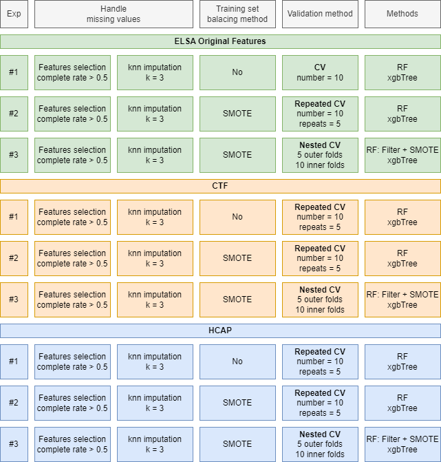

### Experiment 1

Using:

-   Feature selection with complete rate \> 0.5

-   KNN

-   no balancing

-   CV 10 folds

-   with original ELSA data: 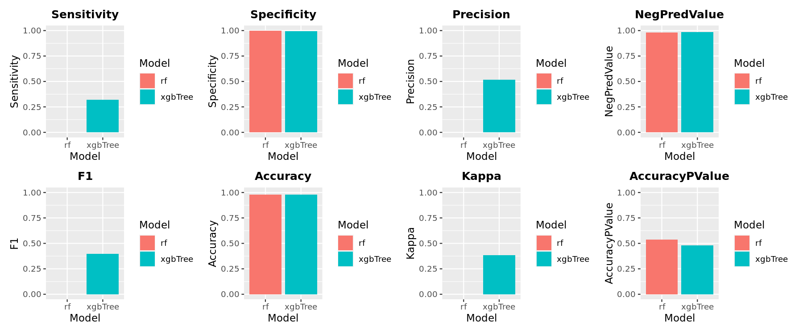  

-   with CTFs: 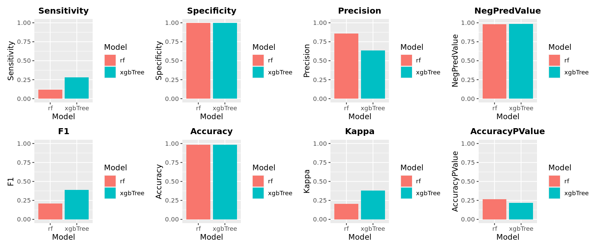  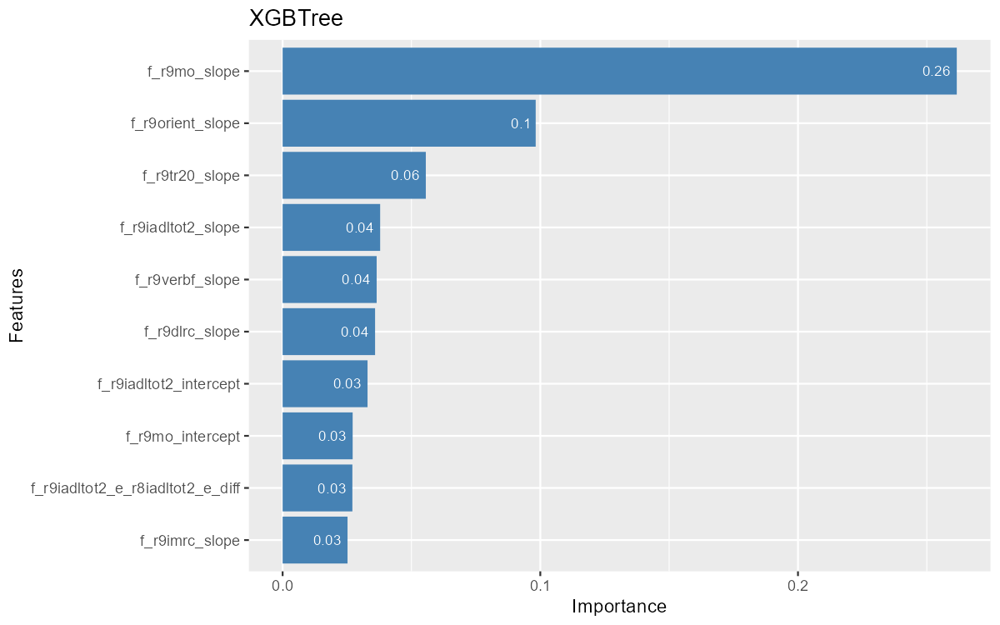

-   with HCAP:   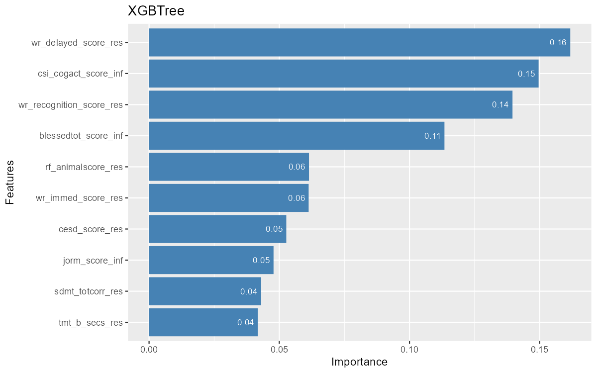

### Experiment 2

Using:

-   Feature selection with complete rate \> 0.5

-   KNN

-   SMOTE

-   CV 10 folds

-   with original ELSA data:   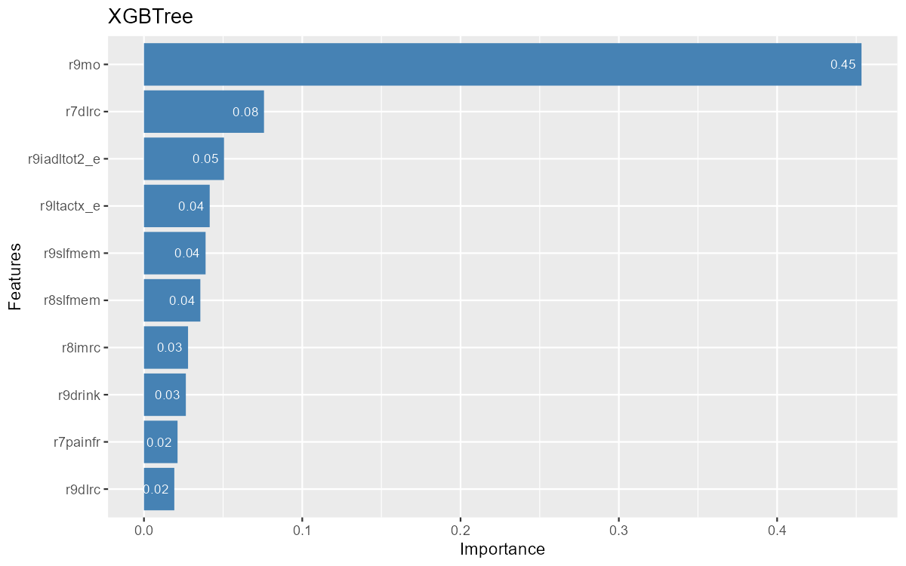

-   with CTFs:   

-   with HCAP: 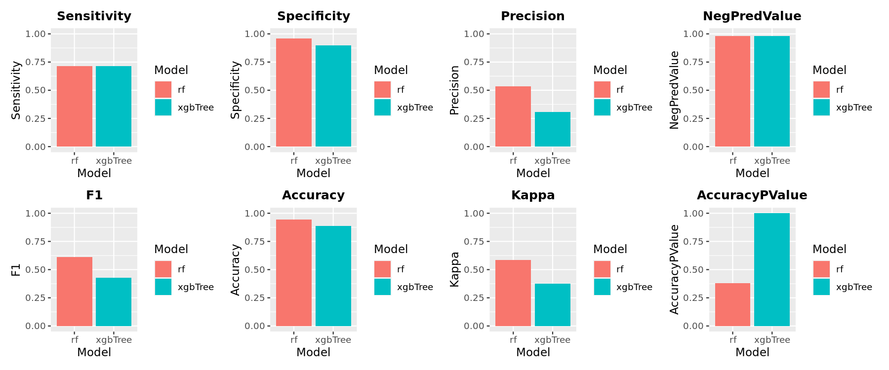  

### Experiment 3

Using:

-   Feature selection with complete rate \> 0.5

-   KNN

-   balancing depends on model

-   nested CV with 5 outer folds and 10 inner folds

-   with original ELSA data: 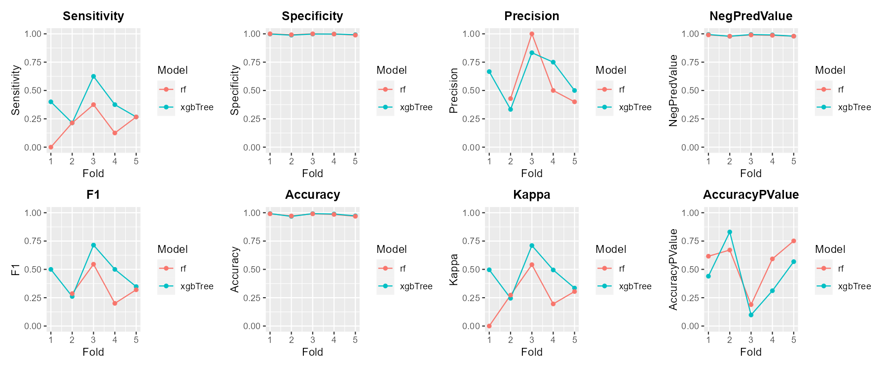  

-   with CTFs: 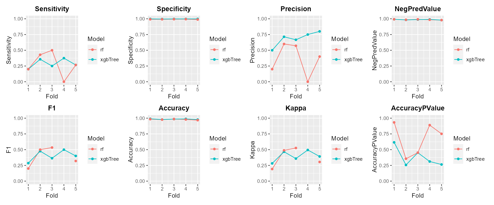  

-   with HCAP:   

### Features importance summary

 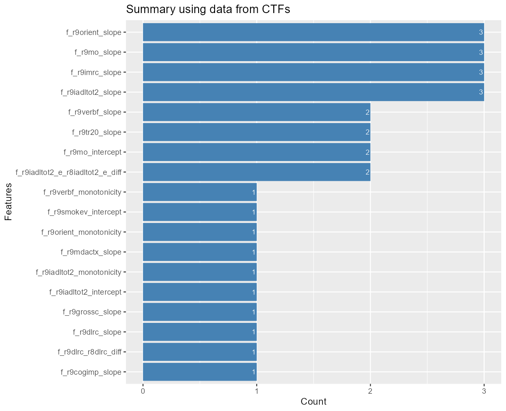
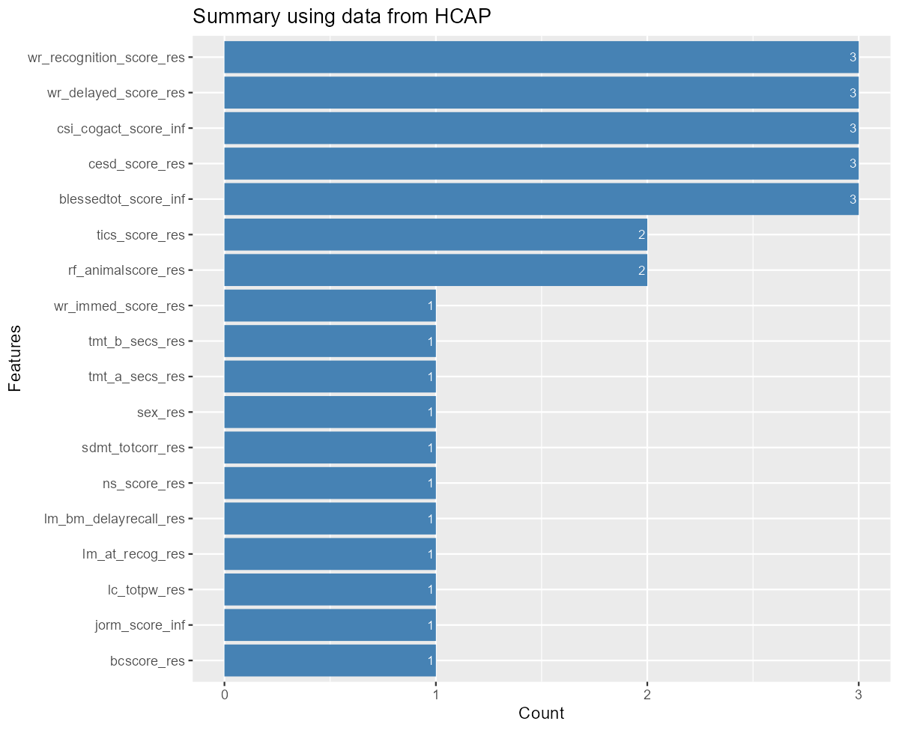
